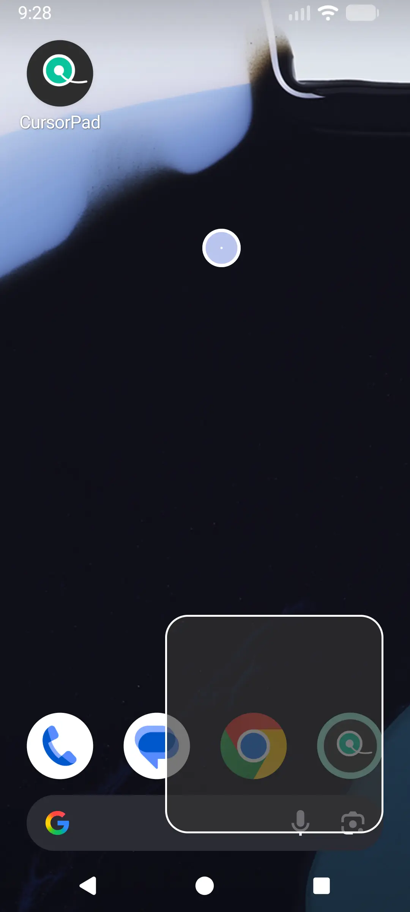

# CursorPad
An overlay touchpad that helps you reach all of your screen with a single hand.

  

## About CursorPad
Smartphones keep getting bigger, and using them one-handed has become a struggle. CursorPad is a privacy-conscious app that aims to make using your phone with one hand a little more convenient.

Trigger the overlay, drag the cursor to an otherwise unreachable part of the screen and tap on the touchpad to interact.

## Requirements
The app requires Android 13 or later.

## Usage
The overlay toggle in the home screen enables Cursor Pad. This does not make the touchpad visible, rather it allows it to be summoned.

### Enabling the cursor and touchpad
To make the cursor and touchpad visible, swipe inwards from either edge of the screen in the lower section. You should see a cursor and a touchpad appear.

### Moving
To move the cursor around drag your finger on the touchpad.

### Tap & Long Press
- To tap the element under the cursor (button, app, etc.) tap on the touchpad.
- For a long press, just hold on the touchpad instead.

## Features
- Configurable touchpad - adjust position, size, opacity, color
- Configurable cursor - adjust cursor size, border size, color
- Configurable touchpad toggle area - adjust the height and width 
- Separate touchpad for left & right hands

## Privacy
CursorPad collects **no data**. There is no `INTERNET` permission declared in the android manifest. This means the app **cannot** make network requests. All the settings stay on your device.

## Accessibility Permission
On Android, accessibility permission is the most dangerous permission and it is frequently abused by malware to harvest data, gain sensitive information, perform unauthorized actions on the user's behalf. In general, an app should have a *very* good reason to ask for it.
This app needs the accessibility permission for simulating touch, that's all it does. There's no sidestepping this permission. The app simply cannot function without it.
Sideloaded apps have a slightly more convoluted path for enabling accessibility. Accessibility permissions are restricted by default. Follow the instructions specified in the app to unlock it.

## Installation
There are a few things to be aware of before installing the app:
- While installing the app, you may be shown a warning by Play Protect. This is because the app is sideloaded and requires accessibility permission. If you see a button for "More Info", press it then press "Install anyway".
- If play protect blocks the app installation, you will have to disable Play Protect:
  1. Open the Google Play Store and tap your profile.
  2. Then Play Protect > Gear icon > Turn off "Scan apps with Play Protect". You can pause it or turn it off altogether.
  3. Install the app.
  4. (Optional) Re-enable Play Protect afterwards.

## Credits
- Swipe Animation by Rudi Louw from LottieFiles
